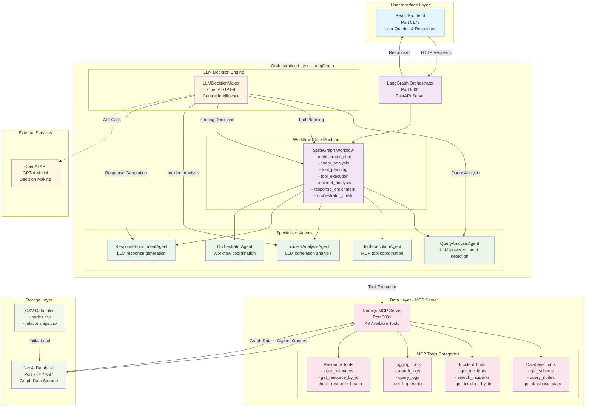
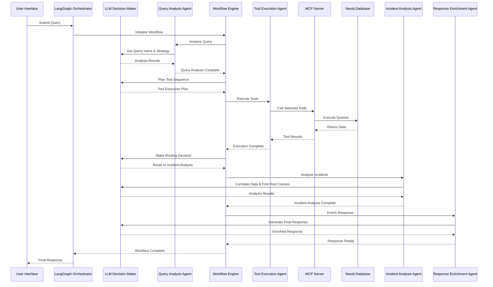
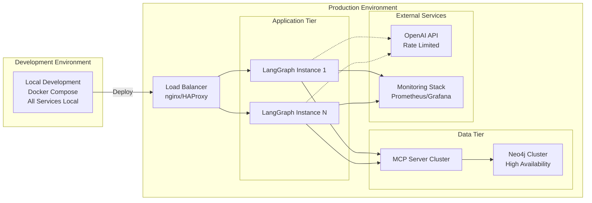

# MCP Demo Project - LLM-Driven Architecture

## High-Level System Architecture

## Detailed Component Flow

### 1. Request Processing Flow

## Key Architecture Principles

### 🤖 LLM-First Decision Making
- **Central Intelligence**: All decision points use OpenAI GPT-4 for dynamic reasoning
- **No Hardcoded Logic**: Replaced all if/else chains with LLM analysis
- **Context-Aware**: LLM receives full context including available tools, query history, and results

### 🔄 State-Driven Orchestration
- **LangGraph StateGraph**: Manages complex workflow state transitions
- **Memory Persistence**: MemorySaver maintains conversation context
- **Error Recovery**: Robust error handling with fallback mechanisms

### 🛠️ Tool-Agnostic Execution
- **MCP Protocol**: 43 specialized tools for data access and manipulation
- **Dynamic Selection**: LLM chooses optimal tools based on query requirements
- **Parallel Execution**: Support for concurrent tool execution when appropriate

### 📊 Graph Database Integration
- **Neo4j Backend**: Rich graph relationships for complex data queries
- **Cypher Query Language**: Powerful graph traversal and pattern matching
- **CSV Import Pipeline**: Structured data loading from external sources

## System Capabilities

### 🔍 Intelligent Query Analysis
- **Intent Detection**: LLM identifies user goals and required information
- **Entity Extraction**: Automatic identification of resources, incidents, timestamps
- **Strategy Planning**: Dynamic investigation approach based on query complexity

### 🚨 Advanced Incident Analysis
- **Root Cause Investigation**: LLM correlates logs, changes, and incidents
- **Timeline Reconstruction**: Chronological event analysis
- **Impact Assessment**: Severity and scope evaluation with recommendations

### 📈 Adaptive Response Generation
- **Context-Rich Responses**: Incorporates insights from multiple data sources
- **Forward Links**: Suggests next actions and related investigations
- **Confidence Scoring**: Transparent uncertainty communication

### 🔧 Operational Excellence
- **Health Monitoring**: Comprehensive service health checks
- **Performance Metrics**: Tool execution success rates and timing
- **Scalable Architecture**: Docker containerization for easy deployment

## Technology Stack

### Frontend Layer
- **React 18**: Modern component-based UI
- **Vite**: Fast development and build tooling
- **CSS3**: Responsive styling

### Orchestration Layer
- **Python 3.11+**: Core runtime environment
- **LangGraph 0.2.14+**: State machine orchestration
- **FastAPI**: High-performance async web framework
- **OpenAI API**: GPT-4 integration for intelligence

### Data Layer
- **Node.js**: MCP server runtime
- **Neo4j 5.x**: Graph database engine
- **CSV Processing**: Structured data import

### Infrastructure
- **Docker Compose**: Multi-service orchestration
- **Health Checks**: Service availability monitoring
- **Port Management**: Clean service separation

## Deployment Architecture

## Future Enhancements

### 🔮 Advanced AI Capabilities
- **Multi-Model Support**: Integration with Claude, Gemini, and local models
- **Specialized Fine-Tuning**: Domain-specific model training
- **Agentic Workflows**: Self-improving investigation strategies

### 📡 Enhanced Integrations
- **Real-Time Streaming**: Live data feeds and continuous monitoring
- **External APIs**: Integration with ITSM, monitoring, and alerting systems
- **Webhook Support**: Event-driven automation triggers

### 🔐 Security & Compliance
- **Authentication**: OAuth2/SAML integration
- **Authorization**: Role-based access control (RBAC)
- **Audit Logging**: Comprehensive activity tracking
- **Data Encryption**: End-to-end security

This architecture represents a state-of-the-art LLM-driven chatbot system that combines the power of large language models with structured data access, intelligent workflow orchestration, and comprehensive incident analysis capabilities.