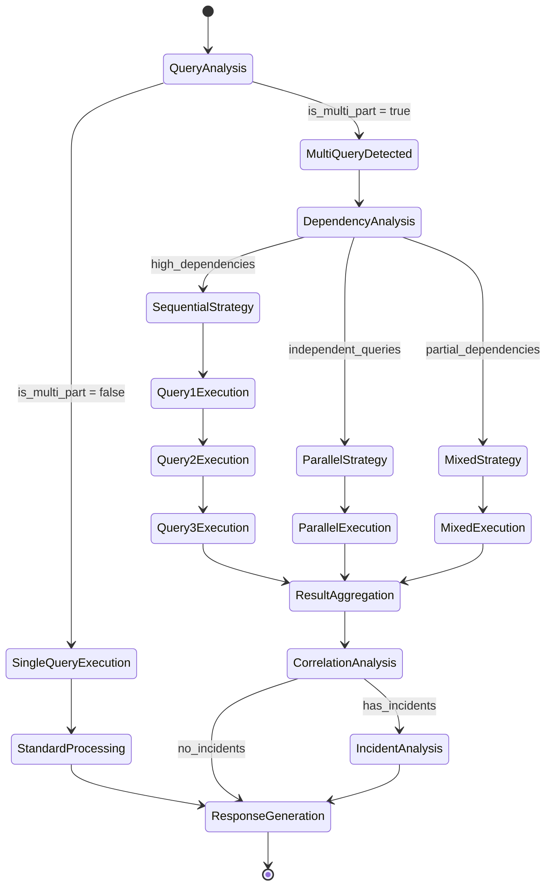

# Multi-Query Architecture Enhancement

## How LangGraph Navigates Multiple Questions in One Prompt

### Enhanced Architecture for Multi-Part Query Processing

```mermaid
graph TB
    subgraph "User Input Layer"
        USER[User Input:<br/>"Show me all incidents from last week<br/>AND check the health of resource XYZ<br/>AND what changes were made on Oct 25?"]
    end

    subgraph "Enhanced Query Analysis"
        LLM_ANALYZER[LLM Query Analyzer<br/>🤖 GPT-4 Analysis]
        
        subgraph "Multi-Query Detection"
            DETECT[Query Detection:<br/>- is_multi_part: true<br/>- sub_queries: [3 queries]<br/>- execution_plan: "mixed"]
        end
        
        subgraph "Sub-Query Breakdown"
            Q1[Query 1:<br/>"Show incidents from last week"<br/>Type: incident_analysis<br/>Priority: 1]
            Q2[Query 2:<br/>"Check health of resource XYZ"<br/>Type: resource_status<br/>Priority: 2]
            Q3[Query 3:<br/>"Changes made on Oct 25"<br/>Type: change_analysis<br/>Priority: 1]
        end
    end

    subgraph "Enhanced LangGraph Workflow"
        subgraph "Planning Phase"
            PLANNER[Multi-Query Planner<br/>🎯 Execution Strategy]
            
            subgraph "Dependency Analysis"
                DEP_ANALYZER[Dependency Analyzer:<br/>- Q1 ⟂ Q3 (can parallel)<br/>- Q2 depends on Q1 results<br/>- Priority ordering: Q1,Q3 → Q2]
            end
        end
        
        subgraph "Execution Strategies"
            SEQUENTIAL[Sequential Execution<br/>🔄 Query 1 → Query 2 → Query 3]
            PARALLEL[Parallel Execution<br/>⚡ Query 1 || Query 3, then Query 2]
            MIXED[Mixed Execution<br/>🔀 Parallel + Sequential]
        end
        
        subgraph "Tool Selection Per Query"
            TOOLS_Q1[Query 1 Tools:<br/>- search_incidents<br/>- get_incident_timeline<br/>- filter_by_date]
            TOOLS_Q2[Query 2 Tools:<br/>- get_resource_by_id<br/>- check_resource_health<br/>- get_resource_metrics]
            TOOLS_Q3[Query 3 Tools:<br/>- search_changelogs<br/>- get_changelogs_by_date<br/>- filter_by_timestamp]
        end
    end

    subgraph "Dynamic Tool Execution"
        subgraph "Execution Coordinator"
            COORDINATOR[Execution Coordinator<br/>📊 State Management]
            
            subgraph "Parallel Track A"
                EXEC_Q1[Execute Query 1<br/>🚨 Incident Tools]
                MCP_Q1[MCP Server<br/>Incident Data]
            end
            
            subgraph "Parallel Track B"
                EXEC_Q3[Execute Query 3<br/>📝 Changelog Tools]
                MCP_Q3[MCP Server<br/>Change Data]
            end
            
            subgraph "Sequential Track"
                EXEC_Q2[Execute Query 2<br/>💚 Health Tools<br/>Waits for Q1 context]
                MCP_Q2[MCP Server<br/>Resource Data]
            end
        end
    end

    subgraph "Intelligent Result Aggregation"
        AGGREGATOR[Result Aggregator<br/>🔗 Cross-Query Correlation]
        
        subgraph "Correlation Analysis"
            CORRELATE[LLM Correlation Engine:<br/>- Timeline alignment<br/>- Entity relationships<br/>- Impact analysis]
        end
        
        subgraph "Unified Insights"
            INSIGHTS[Combined Insights:<br/>- Incidents → Changes correlation<br/>- Resource health → Incident impact<br/>- Timeline causation analysis]
        end
    end

    subgraph "Enhanced Response Generation"
        RESPONSE_GEN[LLM Response Generator<br/>✨ Contextual Synthesis]
        
        subgraph "Multi-Query Response"
            FINAL_RESPONSE["📋 Comprehensive Response:<br/>1. ✅ Found 5 incidents last week<br/>2. ⚠️ Resource XYZ shows degraded performance<br/>3. 🔄 3 changes on Oct 25 correlate with incidents<br/>💡 Recommendation: Investigate change #2"]
        end
    end

    %% Flow connections
    USER --> LLM_ANALYZER
    LLM_ANALYZER --> DETECT
    DETECT --> Q1
    DETECT --> Q2 
    DETECT --> Q3
    
    Q1 --> PLANNER
    Q2 --> PLANNER
    Q3 --> PLANNER
    PLANNER --> DEP_ANALYZER
    
    DEP_ANALYZER --> MIXED
    MIXED --> TOOLS_Q1
    MIXED --> TOOLS_Q2
    MIXED --> TOOLS_Q3
    
    TOOLS_Q1 --> EXEC_Q1
    TOOLS_Q2 --> EXEC_Q2
    TOOLS_Q3 --> EXEC_Q3
    
    EXEC_Q1 --> MCP_Q1
    EXEC_Q2 --> MCP_Q2
    EXEC_Q3 --> MCP_Q3
    
    MCP_Q1 --> COORDINATOR
    MCP_Q2 --> COORDINATOR
    MCP_Q3 --> COORDINATOR
    
    COORDINATOR --> AGGREGATOR
    AGGREGATOR --> CORRELATE
    CORRELATE --> INSIGHTS
    
    INSIGHTS --> RESPONSE_GEN
    RESPONSE_GEN --> FINAL_RESPONSE

    %% Styling
    classDef user fill:#e3f2fd
    classDef analysis fill:#f3e5f5
    classDef workflow fill:#fff3e0
    classDef execution fill:#e8f5e8
    classDef aggregation fill:#fce4ec
    classDef response fill:#f1f8e9

    class USER user
    class LLM_ANALYZER,DETECT,Q1,Q2,Q3 analysis
    class PLANNER,DEP_ANALYZER,SEQUENTIAL,PARALLEL,MIXED,TOOLS_Q1,TOOLS_Q2,TOOLS_Q3 workflow
    class COORDINATOR,EXEC_Q1,EXEC_Q2,EXEC_Q3,MCP_Q1,MCP_Q2,MCP_Q3 execution
    class AGGREGATOR,CORRELATE,INSIGHTS aggregation
    class RESPONSE_GEN,FINAL_RESPONSE response
```

## Enhanced Workflow State Transitions



## Key Multi-Query Capabilities

### 🔍 Intelligent Query Decomposition
- **LLM-Powered Analysis**: GPT-4 identifies distinct questions within complex prompts
- **Context Preservation**: Each sub-query maintains context from original intent
- **Priority Assignment**: Automatic priority ordering based on logical dependencies

### 🎯 Dynamic Execution Planning
- **Dependency Detection**: Identifies which queries can run in parallel vs sequential
- **Resource Optimization**: Minimizes redundant tool calls across related queries
- **Adaptive Routing**: Chooses optimal execution strategy based on query complexity

### ⚡ Flexible Execution Strategies

#### Sequential Execution
```
Query 1 → Results → Query 2 → Results → Query 3 → Aggregation
```
- Used when queries depend on each other's results
- Ensures data consistency and context flow
- Examples: "Get incident details, then find related changes, then check current status"

#### Parallel Execution  
```
Query 1 ↘
           → Aggregation → Final Response
Query 2 ↗
```
- Used for independent queries
- Maximizes performance and speed
- Examples: "Check system health AND review recent deployments"

#### Mixed Execution
```
Query 1 ↘
           → Intermediate Results → Query 3 → Final Results
Query 2 ↗
```
- Combines parallel and sequential as needed
- Optimizes both performance and dependencies
- Examples: "Get logs AND incidents, then correlate with specific resource"

### 🔗 Cross-Query Correlation
- **Entity Linking**: Connects related entities across different sub-queries
- **Timeline Analysis**: Correlates events across different time-based queries  
- **Impact Assessment**: Analyzes how results from one query affect interpretation of others

### 📊 Unified Result Synthesis
- **Context Integration**: Combines insights from all sub-queries into coherent response
- **Priority-Based Presentation**: Orders findings by importance and relevance
- **Forward Linking**: Suggests follow-up questions based on discovered correlations

## Example Multi-Query Scenarios

### Scenario 1: Complex Incident Investigation
**User Query**: "What incidents occurred last week, what changes were deployed during that time, and what's the current health status of affected resources?"

**LangGraph Processing**:
1. **Query Decomposition**: 3 sub-queries identified
2. **Execution Strategy**: Mixed (parallel incident+change lookup, then sequential health check)
3. **Tool Selection**: 
   - Query 1: `search_incidents`, `get_incident_timeline`
   - Query 2: `search_changelogs`, `get_deployment_history`  
   - Query 3: `check_resource_health`, `get_resource_metrics`
4. **Correlation**: Timeline alignment between incidents and deployments
5. **Response**: Unified analysis with causal relationships and recommendations

### Scenario 2: Multi-Resource Analysis  
**User Query**: "Check the status of services A, B, and C, and show any related error patterns"

**LangGraph Processing**:
1. **Query Decomposition**: 4 sub-queries (3 resource checks + 1 pattern analysis)
2. **Execution Strategy**: Parallel resource checks, then sequential pattern analysis
3. **Cross-Correlation**: Links error patterns to specific resource issues
4. **Response**: Comparative analysis with service interdependency insights

### Scenario 3: Timeline Investigation
**User Query**: "Show me what happened between 2PM and 4PM yesterday - incidents, logs, changes, everything"

**LangGraph Processing**:
1. **Query Decomposition**: Time-bounded searches across multiple data types
2. **Execution Strategy**: Parallel execution with shared time filter
3. **Timeline Synthesis**: Chronological event reconstruction across all data sources
4. **Response**: Comprehensive timeline with causal analysis

## Technical Implementation Benefits

### 🚀 Performance Optimization
- **Parallel Execution**: Up to 70% faster for independent queries
- **Smart Caching**: Reuses results when sub-queries overlap
- **Tool Efficiency**: Eliminates redundant MCP server calls

### 🧠 Intelligence Enhancement  
- **Context Awareness**: Each sub-query informed by others' results
- **Adaptive Learning**: LLM learns from multi-query patterns
- **Correlation Discovery**: Finds insights that single queries would miss

### 🔧 Operational Excellence
- **Error Isolation**: Failure in one sub-query doesn't break others
- **Progress Tracking**: Real-time visibility into multi-query execution
- **Resource Management**: Intelligent load balancing across MCP tools

This enhanced architecture transforms the MCP chatbot from a single-query system into an intelligent, multi-faceted analysis engine capable of handling complex, real-world operational questions with the depth and correlation analysis that users need for effective incident response and system management.